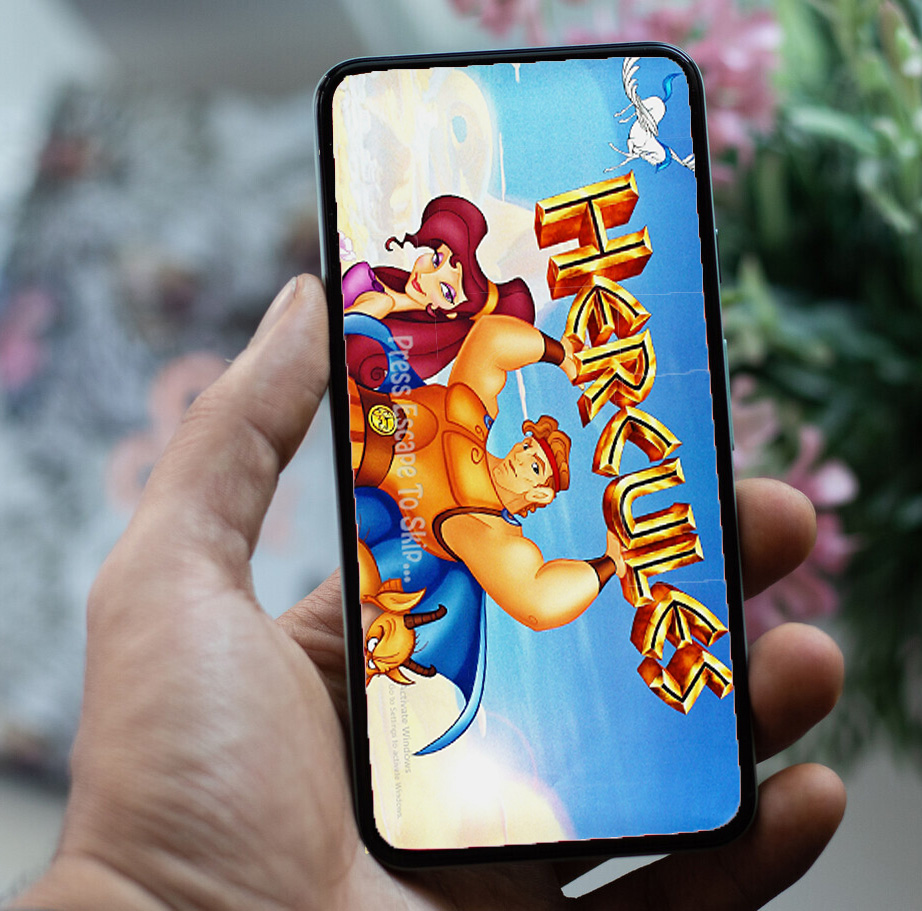
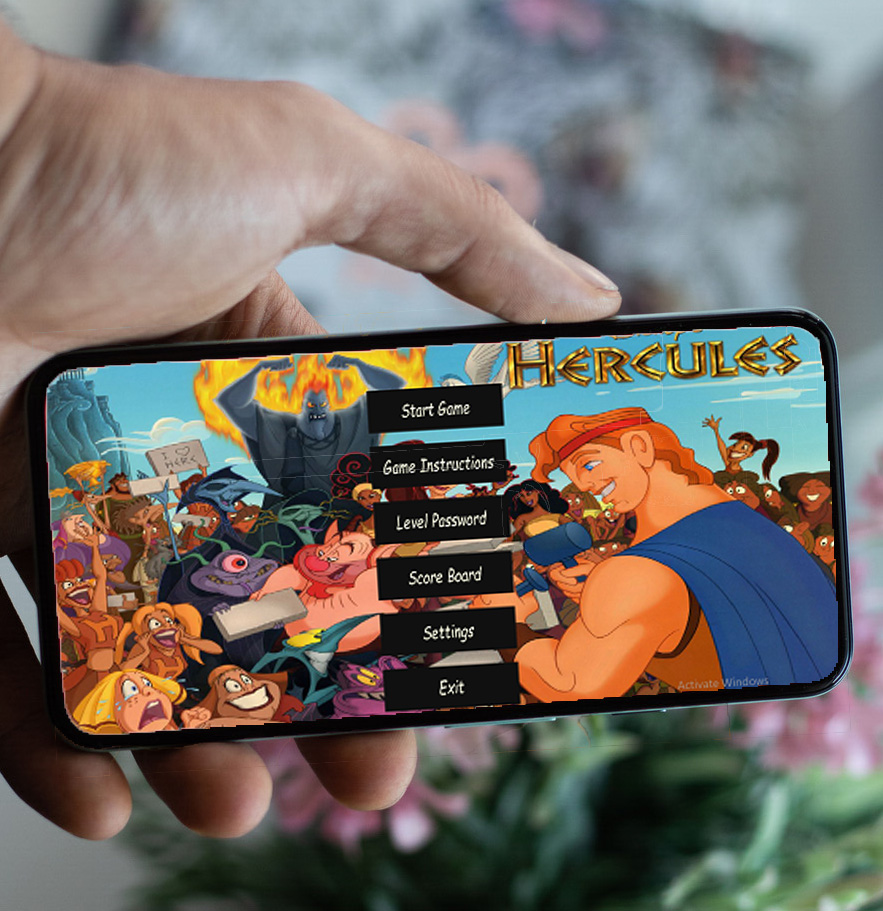
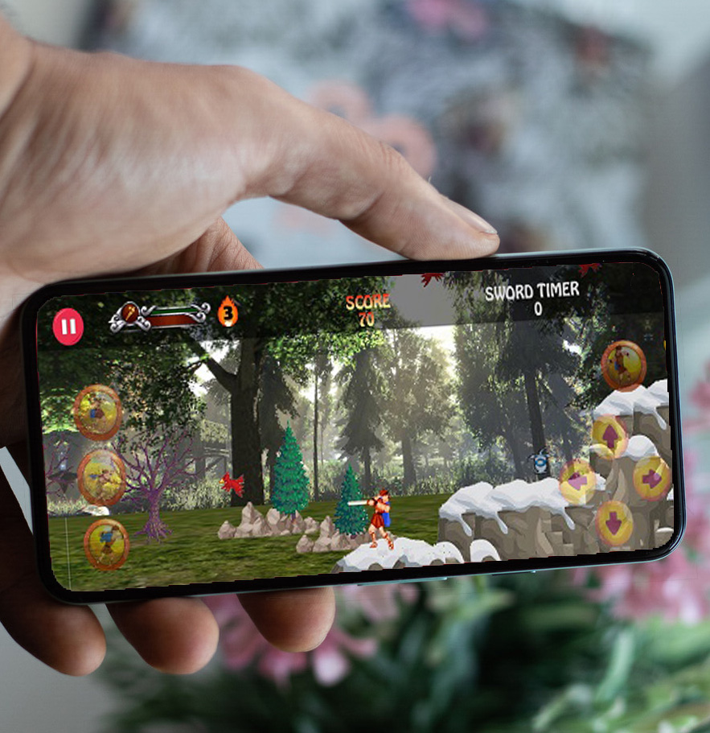
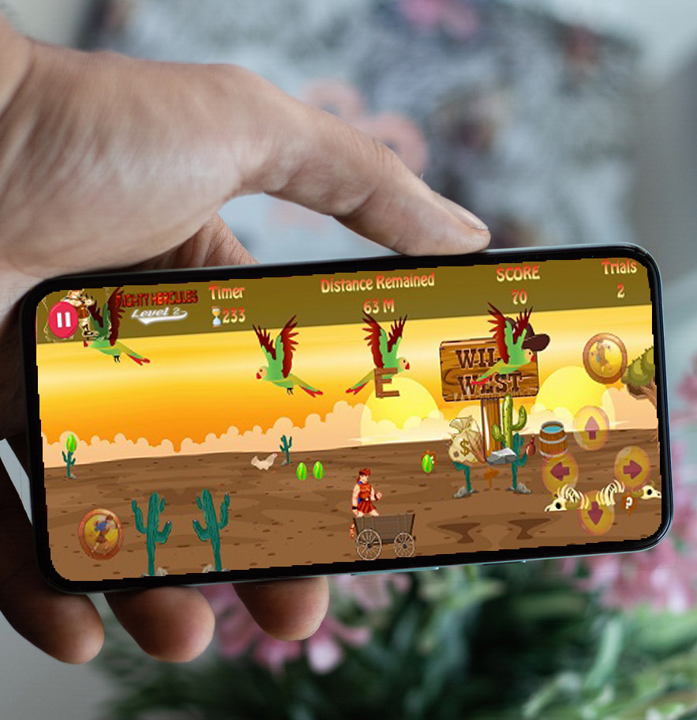
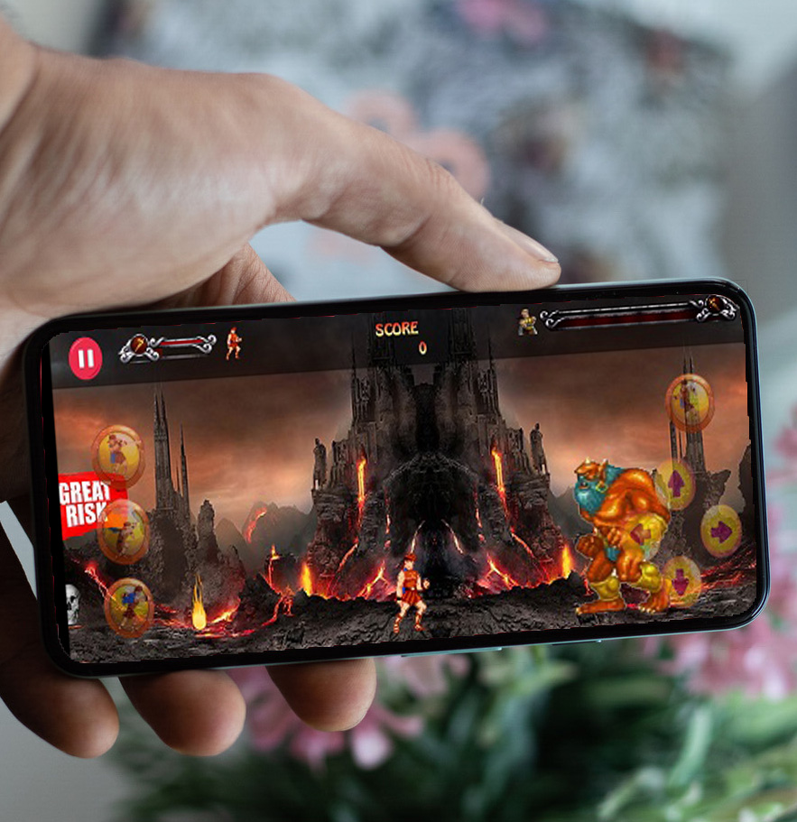

# Hercules-Game-

### Game Description 

Disney’s Hercules, also known in Europe as Disney’s Action Game Featuring Hercules,   is a action video game for the PlayStation and Microsoft Windows, released on June 20, 1997 by Disney Interactive,   
based on the animated film of the same name.   
It was released a week prior to the film’s release, and this is <b> Our Android Edition </b>.  

##### Tools Used
- TiledMap
- libGdx cross platform game library
- OOP Concepts
- MVC Model

****************************************************************************************
### Some Screenshots

****************************************************************************************
